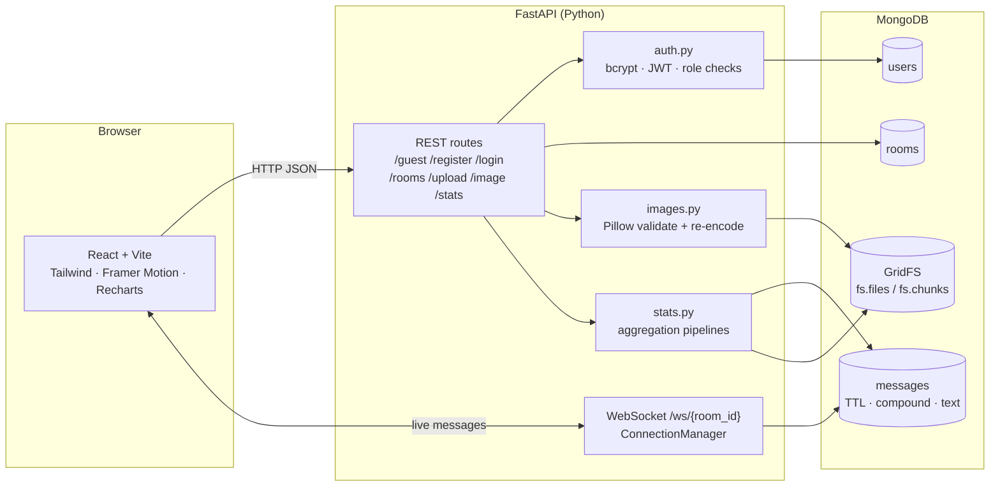

# Whisper — Anonymous Web Chat (NoSQL OEE, BISNS701)

A free real-time chat app. Anyone can join public rooms as a **guest** (random alias, messages auto-expire), or **register** to upload pictures and keep their messages. Built to demonstrate MongoDB: `$jsonSchema` validation, unique / compound / TTL / text indexes, `explain()`, aggregation pipelines and GridFS.

| | Guest | Registered member |
|---|---|---|
| Sign-up | None — server gives a random alias + temporary JWT | Email + password (bcrypt) |
| Chat in public rooms | Yes | Yes |
| Upload pictures | No (view only) | Yes (GridFS) |
| Message retention | Auto-deleted after 24 h (TTL index) | Kept |

## Architecture



## Project layout

```
app/
  main.py        FastAPI app and all routes (REST + WebSocket)
  db.py          Mongo connection, $jsonSchema validators, index creation
  auth.py        bcrypt, JWT, guest aliases, role checks
  messages.py    save_message / get_history (cursor pagination)
  ws.py          WebSocket connection manager (per-room broadcast)
  images.py      upload validation, EXIF stripping, GridFS helpers
  stats.py       aggregation pipelines for the dashboard
  ratelimit.py   rate-limit hook (no-op today, Redis later)
  config.py      settings from .env
  models.py      Pydantic request/response models
tests/           pytest suite (runs against the oee_chat_test database)
benchmarks/      explain() with/without index benchmark + saved results
frontend/        React app (src/components, src/pages, src/hooks)
REPORT_NOTES.md  design decisions and measured index results
```

## Setup

**Requirements:** Python 3.11+, Node 18+, MongoDB 7+ running on `localhost:27017` (or an Atlas URI).

### 1. Backend

```bash
python -m venv .venv
# Windows: .venv\Scripts\activate     macOS/Linux: source .venv/bin/activate
pip install -r requirements.txt
cp .env.example .env        # then set a real JWT_SECRET
uvicorn app.main:app --reload --port 8000
```

On start-up the app creates the collections with their validators and all indexes. API docs: <http://localhost:8000/docs>

### 2. Frontend

```bash
cd frontend
npm install
cp .env.example .env        # VITE_API_URL=http://localhost:8000
npm run dev                 # http://localhost:5173
```

### 3. Tests

```bash
pytest                      # 22 tests: rooms, pagination, schema validation, auth, WebSocket, GridFS, stats, replies, typing, presence
```

### 4. Index benchmark

```bash
python benchmarks/explain_benchmark.py          # seeds 100k messages in a separate DB
```

Saves `explain("executionStats")` JSON for each query with and without its index to `benchmarks/results/`, plus `summary.md`.

## API

| Method | Path | Who | Purpose |
|---|---|---|---|
| POST | `/guest` | anyone | random alias + 24 h guest token |
| POST | `/register` | anyone | create member (409 if email exists) |
| POST | `/login` | anyone | member token |
| GET | `/rooms` | anyone | list rooms, each with its live `online` count |
| POST | `/rooms` | anyone | create room (409 on duplicate name) |
| GET | `/rooms/{id}/messages?before=&limit=&q=` | anyone | history, newest first; `before` = oldest message id seen; `q` = text search. Each message carries `reply_to` and a resolved `reply: {id, alias, text}` (`null` if the original expired) |
| WS | `/ws/{room_id}?token=&presence=1` | guest or member | send `{"text", "image_file_id?", "reply_to?"}`, receive `{"type":"message", ...}`. `{"type":"typing"}` is relayed to the rest of the room. With `presence=1` you also receive `{"type":"presence","online":n}` |
| GET | `/presence` | anyone | live `{online, rooms}` counts from open WebSockets (in memory, never stored) |
| POST | `/upload` | members | JPEG/PNG/WebP ≤ 5 MB → re-encoded → GridFS, returns `file_id` |
| GET | `/image/{file_id}` | anyone | streams the image from GridFS |
| GET | `/stats` | anyone | totals (incl. `online`), messages per room, uploads per user |

## Deployment

**Live:** frontend `https://<netlify-site>` · API `https://<render-service>.onrender.com` (filled in after the first deploy)

```
Browser ──HTTPS──▶ Netlify (React build, CDN)
   └──HTTPS + WSS──▶ Render (FastAPI, 1 instance) ──TLS──▶ MongoDB Atlas M0
```

1. **MongoDB Atlas.** Create a free M0 cluster and a database user. Under Network Access, allow `0.0.0.0/0`, because Render's free tier has no fixed IP. Copy the `mongodb+srv://…` connection string.
2. **Render (backend).** Click New → Blueprint and pick this repo. [render.yaml](render.yaml) configures it:
   - a free plan with a single instance (presence and typing are held in memory)
   - a `/health` health check
   - a generated `JWT_SECRET`
   - `ENVIRONMENT=production`, so the app won't start with the default secret
   - `SEED_DEFAULT_ROOMS=true`, which creates General, Anime, Music, Study Group and Cricket the first time the server starts

   In the dashboard, fill in `MONGO_URI` (the Atlas string) and `CORS_ORIGINS` (the Netlify URL).
3. **Netlify (frontend).** Import this repo. [netlify.toml](netlify.toml) sets the base to `frontend/`, builds with `npm run build` and adds the SPA rewrite, so a refresh on `/chat/…` or `/dashboard` still works. Set `VITE_API_URL=https://<render-service>.onrender.com`. WebSockets switch to `wss://` automatically.
4. Set Render's `CORS_ORIGINS` to the final Netlify URL and redeploy.

**What to expect on free tiers**
- **Cold starts:** Render sleeps after about 15 minutes without traffic. The first visitor then waits about 50 seconds, and open chats reconnect on their own.
- **Storage:** Atlas M0 holds 512 MB, and GridFS pictures count towards that.
- **Rate limits** (in memory, in [app/ratelimit.py](app/ratelimit.py)):
  - 5 messages per 5 seconds per sender
  - 10 uploads per hour per member
  - 5 new rooms per 10 minutes, 20 guest sessions per hour and 10 login attempts per minute, per visitor IP
